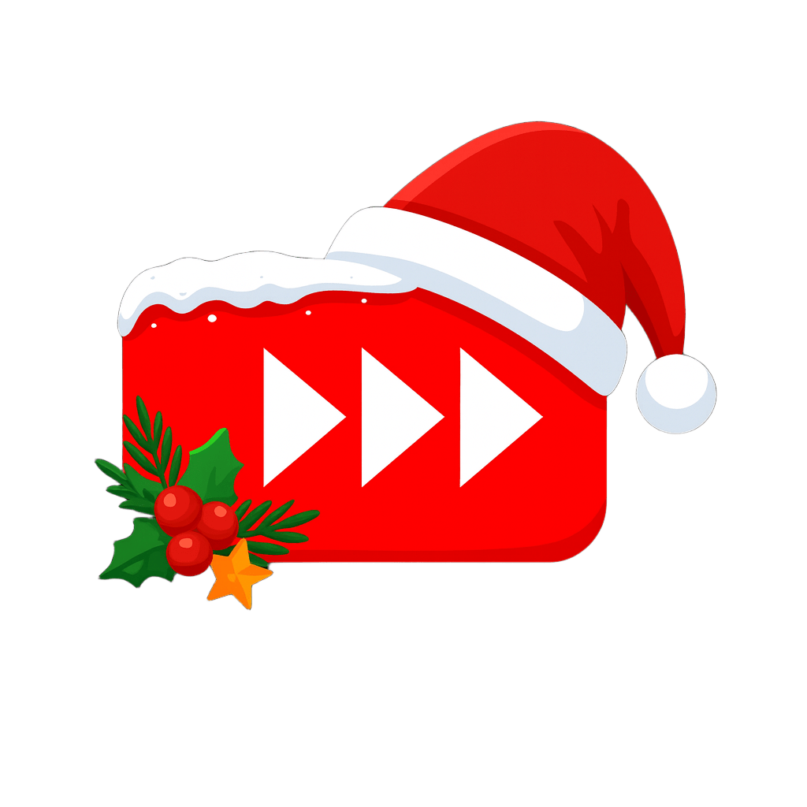

# YouTube Silence Skipper

  

  <strong>Skip silent moments in YouTube videos automatically</strong> 
  Save time and enjoy a smoother viewing experience

  

---

## 🚀 What is YouTube Silence Skipper?

YouTube Silence Skipper is a lightweight Chrome extension that automatically detects and skips silent portions in YouTube videos. Whether you're watching educational content, interviews, or gaming videos, this extension helps you save valuable time by seamlessly advancing through quiet moments without missing any important content.

## ✨ Key Features

| Feature | Description |
|---------|-------------|
| 🎯 **Smart Detection** | Intelligently identifies silent periods in video content |
| ⚡ **Automatic Skipping** | Instantly jumps forward when silence exceeds your threshold |
| 🎛️ **Customizable Settings** | Adjust minimum skip duration and behavior preferences |
| 🔔 **Subtle Notifications** | Get informed about skips without viewing disruption |
| 🛡️ **Ad-Aware** | Automatically pauses during ads and resumes after |
| 🔒 **Privacy First** | No data collection - everything happens locally |
| 🐛 **Debug Mode** | Optional detailed information for power users |

## 📦 Quick Start

### Installation
1. **Add to Chrome**: Install from the [Chrome Web Store](https://chromewebstore.google.com/detail/youtube-silence-skipper/ijlnjklmlhhfodgfpidpnccipnodohgl)
2. **Auto-Activation**: Extension automatically works when you visit YouTube
3. **Customize**: Click the extension icon to adjust settings (optional)

### Basic Usage
- **Just watch videos normally** - silent periods are automatically skipped
- **Click the extension icon** to access settings and preferences
- **Toggle on/off** anytime without page refresh

## 🎯 Perfect For

- **📚 Educational Content** - Lectures, tutorials, online courses
- **🎙️ Interviews & Podcasts** - Skip awkward pauses and delays
- **🎮 Gaming Videos** - Jump past quiet strategic moments
- **🎵 Music Tutorials** - Skip silent demonstration periods
- **👥 Conference Recordings** - Avoid delays between speakers
- **📹 Vlogs & Commentary** - Skip thinking pauses

## ⚙️ Settings & Configuration

Access settings by clicking the extension icon in your browser toolbar:

| Setting | Default | Description |
|---------|---------|-------------|
| **Auto Skip Silence** | Enabled | Toggle automatic skipping on/off |
| **Skip After Manual Seek** | Disabled | Continue skipping after you manually change position |
| **Minimum Skip Duration** | 0.10s | Minimum silence length to trigger a skip |
| **Debug Mode** | Disabled | Show detailed detection information |

## 🔒 Privacy & Security

Your privacy is our priority:
- ✅ **No data collection** or user tracking
- ✅ **Local processing** - everything happens on your device
- ✅ **No external servers** - no data transmission
- ✅ **YouTube-only** - extension only runs on YouTube pages
- ✅ **Open source** - transparent development

## ❓ FAQ

<strong>How does the extension detect silence?</strong>

The extension analyzes video content patterns to identify gaps between spoken content, which typically represent silent periods.

<strong>Does it work with all YouTube videos?</strong>

The extension works with most YouTube videos and provides the best experience with videos that have clear speech patterns.

<strong>Will it affect video quality or performance?</strong>

No. The extension is lightweight and doesn't affect video quality, playback performance, or loading times.

<strong>Can I disable it for specific videos?</strong>

Yes! You can toggle the extension on/off anytime using the extension icon, and changes take effect immediately.

## 🛠️ Technical Requirements

- **Browser**: Google Chrome (version 88+)
- **Platform**: Windows, macOS, Linux
- **Permissions**: Access to YouTube pages only
- **Storage**: < 1MB

## 🤝 Support & Contribution

### Get Help
- 🌐 **Homepage**: [youtube-silence-skipper.github.io](https://youtube-silence-skipper.github.io/)
- 🐛 **Bug Reports**: [GitHub Issues](https://github.com/YouTube-Silence-Skipper/YouTube-Silence-Skipper.github.io/issues)
- 💬 **Questions**: Open an issue with the "question" label

### Show Support
- ⭐ **Star this repository** if you find it useful
- 💝 **Sponsor the project**: [GitHub Sponsors](https://github.com/sponsors/LeeDongGeon1996)
- 📢 **Share with friends** who spend time on YouTube

## 📄 License

This project is open source. See the repository for license details.

---

  <strong>Made with ❤️ for YouTube viewers who value their time</strong> 
  <small>Save hours, not seconds</small>

